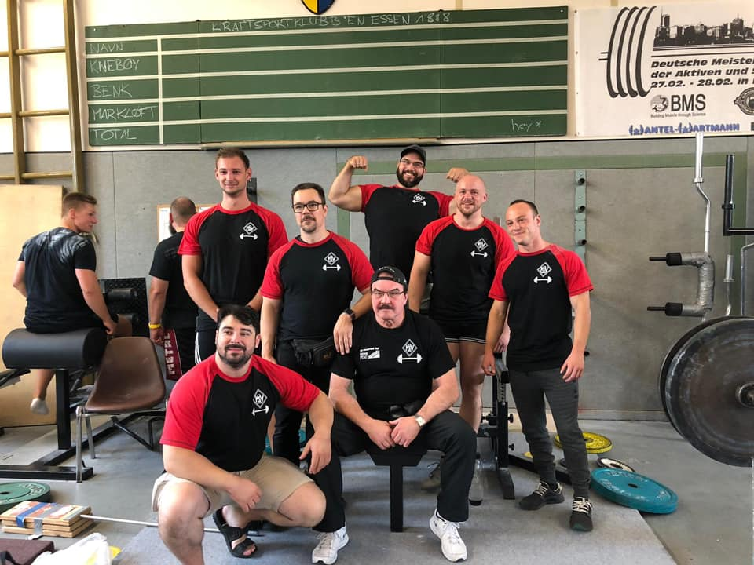

Bei den Landesmeisterschaften im Bankdrücken trat der KSV-Bochum dieses Jahr mit einer fünfköpfigen Mannschaft sowie zwei weiteren Athleten an.

Mit einer Gesamtleistung von 437,5 Wilks Punkten konnte sich die bochumer Mannschaft aus Tobias Haas, Sebastian Schaffarczyk, Dominick Wrobel, Markus Patschke sowie Thomas Frütel als klarer Sieger in der Raw-Wertung durchsetzen.

Tobias Haas bewältigte in seinen dritten Versuch mit enormem Einsatz die Last von 127,5 kg und belegte den ersten Platz in der Klasse Männer bis 66 kg.

Dominick Wrobel schaffte es gerade noch in die stark besetzte 93 kg Klasse und konnte dort mit der neuen Bestleistung von 177,5 kg einen klaren Sieg erringen.

Sebastian Schaffarczyk sicherte sich mit der Leistung von 170 kg souverän den ersten Platz in der Männerklasse bis 105 kg.

Markus Patschke bewältige in der Klasse Männer bis 120 kg die enorme Last von 212,5 kg. Auch wenn er im dritten Versuch knapp an 215 kg scheiterte, gewann er damit nicht nur seine Gewichtsklasse, sondern erzielte auch die beste Relativleistung aller aktiven Männer. Ebenfalls für den KSV Bochum startete in dieser Klasse Michael Berkovsky, der mit der Leistung von 152,5 den zweiten Platz belegte.

Thomas Frütel startete als einziger Athlet der Mannschaft in der Altersklasse I. In der Gewichtsklasse bis 93 kg belegte er dort mit 140 kg Leistung den zweiten Platz hinter Olaf Brandl vom AC Siegen.

Außerhalb der Mannschaftswertung startete für den KSV-Bochum noch Joshua Häger, der in der A-Jugend bis 93 kg mit einer Leistung von 102,5 kg den zweiten Platz belegte.
