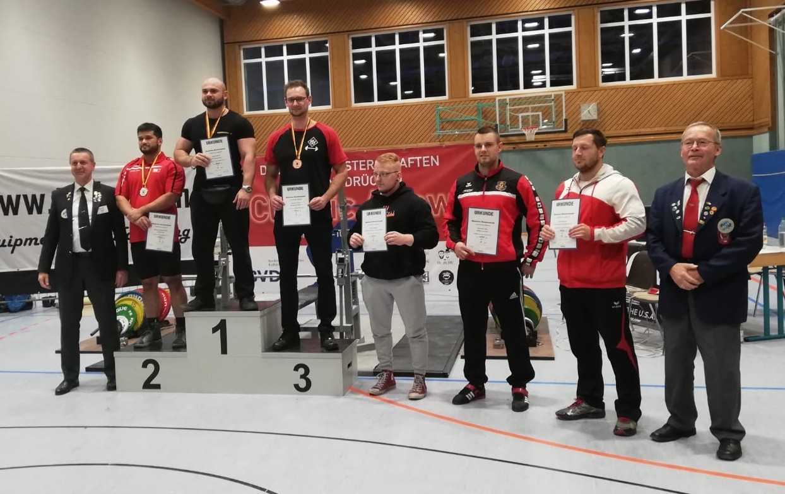
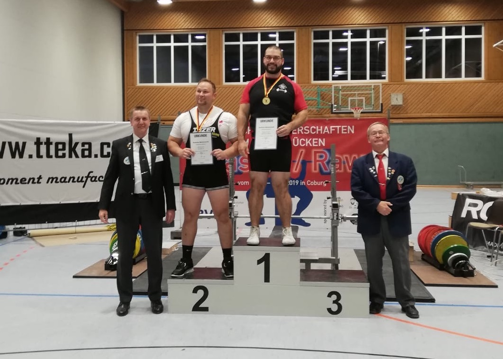

Die Deutschen Meisterschaften im Bankdrücken RAW wurden dieses Jahr von der Coburger Turnerschaft 1861 e.V. ausgerichtet. Mit Dominick Wrobel und Markus Patschke waren auch zwei Athleten des KSV Bochum im Teilnehmerfeld vertreten.

Dominick trat in der Klasse Männer Aktive bis 93 kg Körpergewicht gegen fünf weitere Athleten an. Nach einem missglückten Auftaktversuch bewältigte er die Last im zweiten Versuch. Der dritte Versuch mit 170 kg scheiterte, so dass Dominick mit der Leistung von 165 kg auf dem dritten Platz belegte.

Nur zwei Teilnehmer kämpften in der Klasse Aktive bis 120 kg Körpergewicht um den Titel. Bereits mit seinem ersten Versuch mit 205 kg konnte sich Markus Patschke deutlich von Nikolaj Walter vom AC Siegen absetzen. Mit 215 kg im zweiten Versuch konnte er seinen Vorsprung von 20 kg halten. Obwohl der dritte Versuch mit 220 kg leider scheiterte, errang Markus mit dieser Leistung eine verdiente Goldmedaille.

