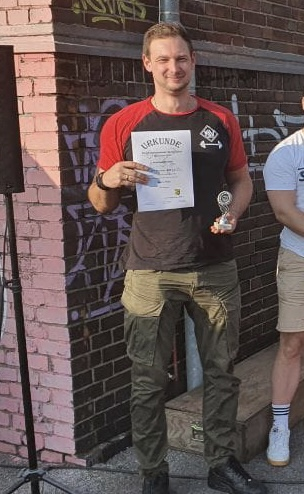
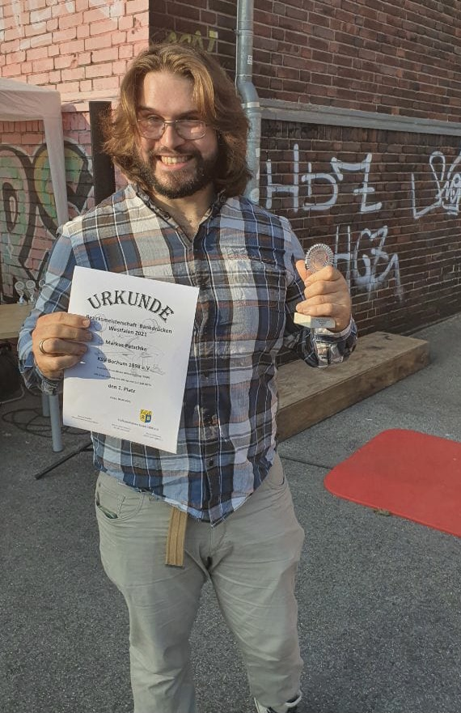

Am 04.09.2021 richtete der KSV-Essen die Bezirksmeisterschaften im Bankdrücken
für die Bezirke Niederrhein und Westfalen. Durch die erfreuliche Wettersituation
konnte der Wettkampf ins Freie verlegt werden, was für eine außergewöhnliche
Wettkampfstimmung sorgte.

Für den KSV-Bochum gingen Dominick Wrobel und Markus Patschke an den Start. Mit
101,1 kg Körpergewicht startete Dominick eine Gewichtsklasse höher als sonst.
Nachdem ihm sein erster Versuch mit 175 kg missglückt war, konnte er das Gewicht
im zweiten Versuch bewältigen und erzielte mit 182,5 kg im dritten Versuch eine
neue persönliche Bestleistung. In der Klasse bis 105 kg Körpergewicht konnte er
sich damit gegen drei weitere Athleten durchsetzen und belegte klar den ersten
Platz.

Auch Markus war schwerer als gewohnt und rutschte mit einem Gewicht von 121.1 kg
in die Klasse ab 120 kg Körpergewicht. Nach der erfolgreichen Eröffnung mit
200 kg bewältigte er 205 kg im zweiten Versuch. Der dritte Versuch mit einer
Last von 210 kg war leider nicht erfolgreich. Als einziger Teilnehmer in dieser
Gewichtsklasse durfte auch er sich über eine Goldmedaille freuen. Ferner
erzielte er mit 117,18 Punkten die beste Relativleistung in der aktiven
Männerklasse.
